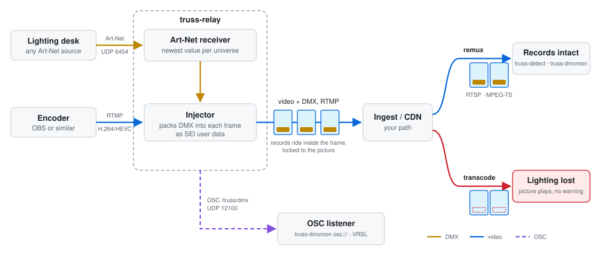
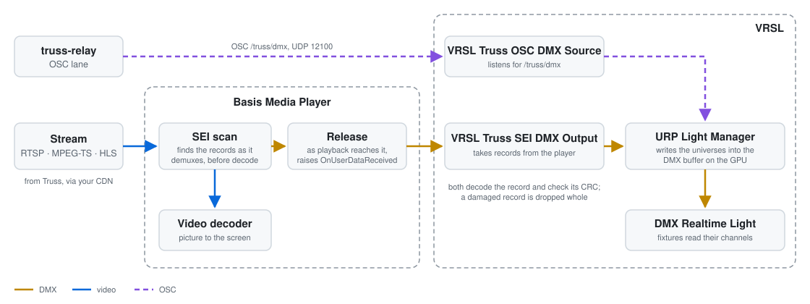

# Truss

DMX lighting control carried inside a live video stream, as H.264 or HEVC SEI user data.

Truss takes the Art-Net from a lighting desk and packs it into the video
as that passes through an RTMP relay. The DMX then travels inside each access
unit, through the ingest and the CDN to every viewer, locked to the picture.

It goes into the SEI, the part of each access unit set aside for extra data,
which decoders pass over when they draw the frame. The picture reaches viewers
exactly as the encoder made it.

<picture>
  <source media="(prefers-color-scheme: dark)" srcset="docs/how-truss-works-dark.svg">
  
</picture>

At the far end, other products read the records back: the Basis Media Player
finds them in the SEI and hands each one on as playback reaches it, and VRSL
decodes it into DMX for the fixtures. Both were built to the record format
Truss defines, set out in [docs/format.md](docs/format.md).

<picture>
  <source media="(prefers-color-scheme: dark)" srcset="docs/reading-truss-records-dark.svg">
  
</picture>

## Will it work on your path

SEI survives a remux and does not survive a transcode. A CDN that repackages
the stream carries it; one that re-encodes strips it out entirely, and gives no
warning when it does. The video still plays and the lighting data never
arrives.

Check your own path before anything else:

```sh
truss-detect rtmp://your-egress/live/stream --max-seconds 30
```

This reads your egress, H.264 or HEVC, and tells apart the three outcomes that
matter: nothing arrived, something arrived damaged, or something arrived
intact. Only the last is a basis for running a show.

The scheme picks the reader:

| Source | Read by |
| --- | --- |
| `rtsp://`, `rtmp://`, `rtmps://` | ffmpeg, which needs to be on your PATH |
| `http://`, `https://`, a file path, or `-` for stdin | Truss directly, as MPEG-TS |
| `osc://[address][:port]` | Truss directly, as the relay's OSC lane (see below) |

| Option | Effect |
| --- | --- |
| `--max-seconds N` | Stop after N seconds. Required for `osc://`, which has no end |
| `--max-mb N` | Stop after N megabytes |
| `--json <path>` | Write the full report as JSON, for something else to read |
| `--save <path>` | Keep the bytes read, so a disagreement about what arrived can be settled against the capture |
| `--transport` | RTSP lower transport, `tcp` by default |

## A dry run

`truss-detect` needs a stream that already carries records, and before the first
show there is none. `truss-inject` writes them into a file, which is enough to
put the path under test with no desk and no encoder present:

```sh
ffmpeg -i source.mp4 -c:v libx264 -f flv plain.flv
truss-inject --input plain.flv --output carried.flv
ffmpeg -re -i carried.flv -c copy -f flv rtmp://ingest.example.net/live/<key>
```

`-c copy` publishes the file as it stands, and the egress receives exactly the
records `truss-inject` wrote, so `truss-detect` against the egress scores the
path itself. Use `-c:v libx265` in place of `libx264` to check an HEVC path.

Reading the same file back without leaving the machine separates a fault in
the carrier from a fault in the network:

```sh
ffmpeg -i carried.flv -c copy -f mpegts carried.ts
truss-detect carried.ts
```

The body of each record is derived from its sequence number rather than taken
from a desk. A dry run tests that the path carries bytes intact, and says
nothing about whether the lighting is right.

| Option | Default | Effect |
| --- | --- | --- |
| `--carriers` | `sei-unreg,sei-t35` | Carriers to write. The default writes each record twice, once in each SEI type; the relay sends `sei-unreg` only |
| `--payload-len` | 24 | Payload bytes per record, on top of 32 bytes of record framing |
| `--every N` | 1 | Write a record on every Nth video frame |
| `--keyframes-only` | off | Write records on keyframes only |
| `--max-added-kbps` | 250 | Refuse to write the file at all if the records would add more than this |

## Running a show

```sh
truss-relay \
  --listen 127.0.0.1:1935 \
  --publish rtmp://ingest.example.net/live \
  --stream-key-file /run/credentials/truss/key \
  --artnet
```

`--help` on any of the tools lists every flag with its default.

`--listen` is where the encoder sends and `--publish` is where the relay sends
on. `--publish` goes up to the application and no further: the host, the port
after it when it is not 1935, and the application, `live` when none is given.

Point your encoder at `rtmp://127.0.0.1/live` with any stream key. The relay
holds the real one; it never needs entering into the encoder.

The encoder can send H.264 or HEVC; OBS sends HEVC over Enhanced RTMP from
version 29.1. Any other codec passes through the relay untouched, with no
records in it, and the relay warns that it is doing so.

Point the lighting desk at this machine's Art-Net port, 6454 by default. The
relay keeps the newest value for each universe and packs as many universes into
each video frame as fit within `--artnet-max-payload`, 9,216 bytes by default,
which is 17 full universes. When they do not all fit it rotates through them on
the frames that follow, and a universe at the far end of the patch cannot
starve.

A desk that lists nodes rather than broadcasting will find one named Truss;
pick it and assign it the universes to carry. The relay answers `ArtPoll` with
an address on the desk's own subnet, and advertises up to 32 of the universes
it has heard (universe 0 before any), so a desk that searches by universe finds
it too. Until DMX arrives the relay shows which controller found the node,
which tells a desk that has not been patched apart from one that is not there.

`--artnet` on its own listens on every adapter. `--artnet 192.168.1.20` listens
on that adapter only and tells every desk to use that address; add `:port` when
the port is not 6454. A socket bound to one address does not hear the
broadcasts a desk like QLC+ sends by default. Give an address only for a desk
that sends to it on purpose, or to keep Art-Net off a network.

A desk on the same machine shares UDP port 6454 with the relay, and the
operating system picks which socket gets a packet sent to that port. Unless
given an address, the relay also listens on 127.0.0.1, which wins that choice,
and tells a desk on this machine to send there. A desk set to send to localhost
needs no discovery. Send to this node or to localhost, not both, or every
universe arrives twice and shows as a steady share of late packets.

At a terminal the relay shows a panel redrawn in place, covering the encoder,
the ingest, the stream and both lanes, with anything wrong right now listed
beneath. `--show-logging`, or output that is not a terminal, gets a line per
event instead.

`truss-dmxmon` shows what a receiver would decode: values rather than counts.
A stream can deliver every record intact and still carry a snapshot that never
changes. That is a dead show, and it passes every other test.

```sh
truss-dmxmon rtsp://your-egress/live/stream --universe 0
```

`--universe` prints that universe as a grid. `--watch 0.1-16` prints only the
channels named, and only when they change, which is the quicker way to see
whether one fixture is moving; slots are numbered from 1, as on a desk. It
reads the same sources as `truss-detect`. On a live source at a terminal it
redraws one panel in place, the grid and the watched channels' current values
included; `--show-logging` gives scrolling lines instead. Over RTSP it sees
video only when nothing else on this machine is already reading the stream, so
close other readers first.

## Watching the desk with nothing else running

The relay can send every record it builds to an OSC listener as well as into
the video, and the desk's output can then be watched from a tool on the same
network:

```sh
truss-relay --publish rtmp://ingest.example.net/live --stream-key-file key.txt --artnet --osc 127.0.0.1:12100
truss-dmxmon osc:// --universe 0
```

Each record goes out as one OSC message, `/truss/dmx`, with the record as its
blob argument, carrying the same payload as the stream's. While a publisher is
connected the lane runs at the video's frame rate; with none it runs at
`--osc-rate`, 30 a second by default. The lane numbers its own records, so
loss and order are scored on the lane rather than on the stream.

`--osc` on the relay takes an address and a port. On the listening side,
`osc://` alone listens on every adapter on port 12100, clear of Art-Net, the
VRSL Grid Node and QLC+; `osc://:12200` or `osc://192.168.1.20:12200` listens
elsewhere.

Leave out `--publish` to run the lane alone, for testing against a desk with
no encoder or ingest. Nothing listens for an encoder and no stream key is
needed, and the stream-only flags (`--listen`, `--stream-key-file`,
`--carriers` and the rest) are refused:

```sh
truss-relay --artnet --osc 127.0.0.1:12100
```

`truss-detect osc:// --max-seconds 10` scores the lane the way it scores a
stream. Nothing on this path crosses a CDN. A gap on the lane points at the
relay; a gap in the stream that the lane doesn't show points at the CDN path.

## With no ingest to point at

ffmpeg will accept a publish on a port, which is enough to stand in for an
ingest and put the whole path on one machine. Three terminals, started in this
order, since each waits for the one before it:

```sh
ffmpeg -listen 1 -f flv -i rtmp://127.0.0.1:1936/live -c copy -f mpegts egress.ts
truss-relay --listen 127.0.0.1:1935 --publish rtmp://127.0.0.1:1936/live --stream-key-file key.txt
ffmpeg -re -i source.mp4 -c:v libx264 -f flv rtmp://127.0.0.1:1935/live/anykey
```

OBS can take the place of the third terminal, pointed at the same URL. The key
in `key.txt` can be anything; the stand-in accepts whatever it is given.

`truss-detect egress.ts` then scores what left the far end, and adding
`--artnet` to the relay puts a desk in the same loop. None of it leaves the
machine.

## The stream key

No flag accepts the key. An argument is visible to anything that can list
processes, including other users on the same machine.

Truss resolves the key in this order:

| Source | Intended for |
| --- | --- |
| `--stream-key-file <path>`, or `-` for stdin | Services. systemd `LoadCredential=` places the secret on a tmpfs readable only by the unit, and container secrets are presented as files in the same way |
| `TRUSS_STREAM_KEY` | Convenience, and weaker for it. A process environment is readable through `/proc` on Linux and is retained in crash dumps |
| A prompt | When stdin is a terminal and no earlier source resolved |

An RTMP publish URL is `rtmp://host/app/<key>`: anything that prints the URL
prints the key with it. The relay holds the host, the application and the key
separately. The key goes to the ingest only in the RTMP publish request, and
the relay never prints it: the ingest URL it shows stops at the application.
`--publish` stops there for the same reason. A URL carrying a further segment,
a query, a fragment or a user and password is refused, and the refusal does not
repeat it.

A systemd unit:

```ini
[Service]
LoadCredential=key:/etc/truss/stream.key
ExecStart=/usr/local/bin/truss-relay --publish rtmp://ingest.example.net/live \
          --stream-key-file %d/key --artnet
```

## What arrives

Values are absolute rather than deltas. A late or dropped frame is corrected by
the next, and a client joining part way through a show is correct within one
frame.

Each block carries its own age. Universes are latched as their packets arrive,
and DMX at 44 Hz does not divide evenly into a frame grid, so a consumer needs
to know how stale each universe is rather than assume they were sampled
together.

Each record carries its own magic, length and CRC. A reader can pick one out of
a stream it otherwise knows nothing about, and can tell a record that arrived
damaged from one that never arrived.

The byte layout, the carriers and the standards they rest on (ITU-T H.264 and
H.265 SEI, Art-Net 4, OSC 1.0 and others) are in [docs/format.md](docs/format.md).

## Bitrate cost

The lane shares a bitrate ceiling with the picture, so find out what a given
patch costs before committing to it.

A full snapshot is 8 bytes of header plus 522 for each universe: 512 channels
and a 10-byte block header. At 30 frames per second, with every universe on
every frame:

| Universes | Per frame | Bitrate | Share of a 6,320 kb/s ceiling |
| --- | --- | --- | --- |
| 1 | 530 B | 127 kb/s | 2% |
| 4 | 2,096 B | 503 kb/s | 8% |
| 8 | 4,184 B | 1,004 kb/s | 16% |
| 12 | 6,272 B | 1,505 kb/s | 24% |
| 16 | 8,360 B | 2,006 kb/s | 32% |
| 20 | 10,448 B | 2,508 kb/s | 40% |

The ceiling in the last column is an example: 6,000 kb/s of video and 320 of
audio, counted together. With your own ceiling the percentages change; the
bitrates don't. At twenty universes on every frame the lane takes roughly two
fifths of the ceiling, and the encoder has to be set for the rest. The relay's default
`--artnet-max-payload` of 9,216 bytes fits 17 universes in a frame, and more
than that on every frame needs it raised.

Record framing and NAL overhead come on top of these figures and vary with
content. Long runs of zero channels expand more than active ones, because a
coded bitstream has to break up runs of zero bytes, and an unpatched universe
is mostly zeros.

The relay sends each universe whole, up to the highest slot the desk has sent
for it. The cost comes down in two ways:

- `--every N` injects on every Nth frame, dividing the rate by N at the cost of
  that much delay before a change is carried.
- A lower `--artnet-max-payload` caps the bytes in each frame. Universes past
  the cap rotate onto later frames, and each one is refreshed less often.

The relay also measures what actually leaves, averaged over five seconds,
rather than relying on the arithmetic above. `--warn-kbps` warns when that
average goes above a figure, 5,500 kb/s unless set, and `--abort-kbps` drops
the session rather than let it go above another. Aborting is off unless asked
for.

## Building

```sh
cargo build --release
cargo test
```

Rust 1.88 or newer. Windows and Linux are both supported, and CI builds and
tests both. None of the code is platform-specific.

Every parser here reads bytes it did not choose, so there is generative cover
alongside the unit tests. The properties live in `truss::invariants`, and
`tests/properties.rs` drives them with mutated input as part of `cargo test`,
on stable and with no extra toolchain. The run is deterministic, so a failure
names the case that caused it.

libFuzzer drives the same properties for a deeper search. It's happiest on
Linux, and the default build turns on AddressSanitizer, which needs nightly:

```sh
cargo run --example seed-corpus
cargo +nightly fuzz run ts_feed
```

The seed corpus is built with the crate's own encoders, so a run starts inside
the interesting code rather than working out what a sync byte is. A weekly job
runs each target and keeps its corpus and any input that crashes it.

## Status

Across RTSP, MPEG-TS and RTMP egress on a remuxing CDN: no loss in steady
state, no corruption, payloads up to 10,448 bytes per frame, a median
end-to-end latency of around 112 ms, and 47,038 consecutive frames across half
an hour without a gap. Live desk data has
run the full path at twenty universes.

Discovery has been exercised against SoundSwitch on the relay's own machine,
which lists the node and delivers both its universes with no address given. The
OSC lane has run at the set rate with no publisher and at the video's frame rate
with one, with no gaps on loopback, into the VRSL-URP source and into
`truss-detect`.

Nothing longer than a thirty-minute publish has been measured, and nothing on a
degraded uplink.

## Licence

MIT or Apache-2.0, at your option.
